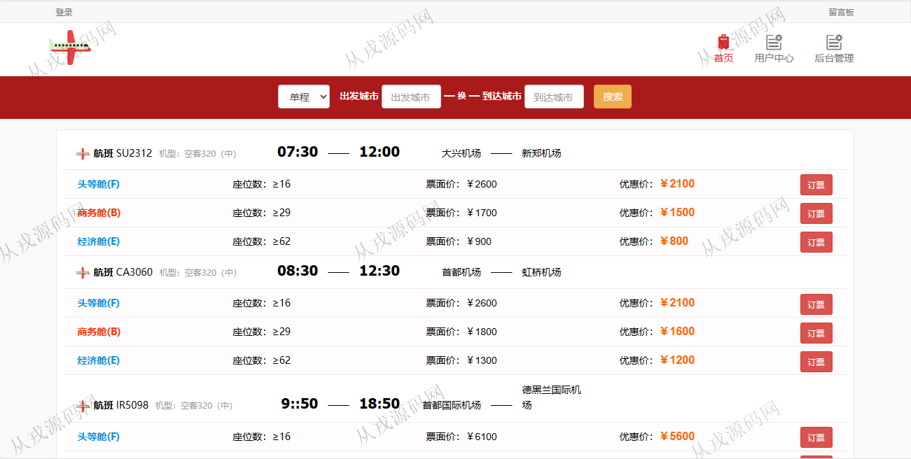
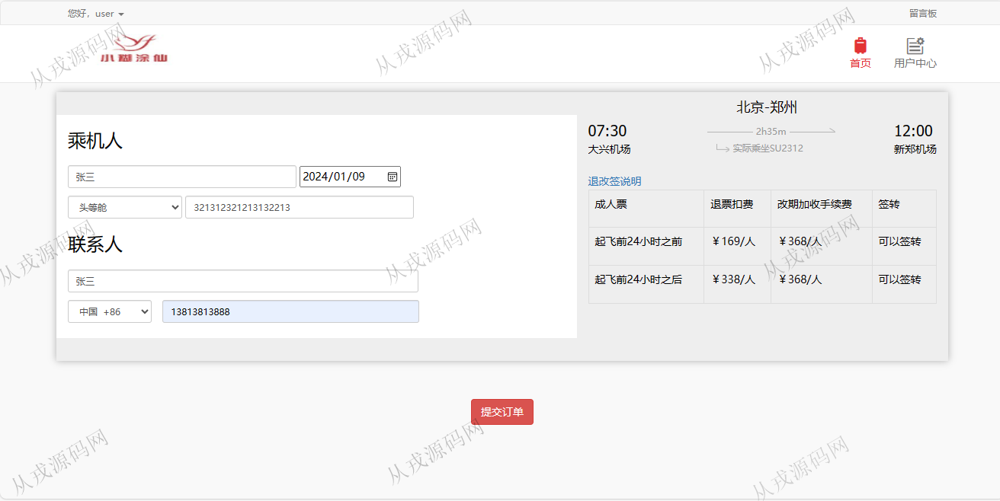
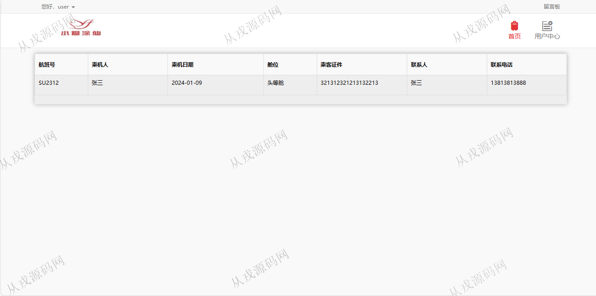
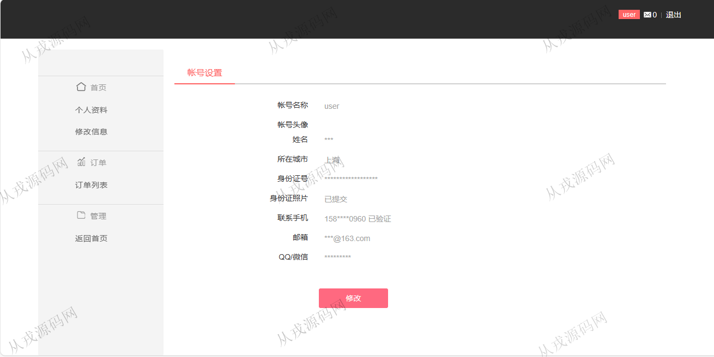
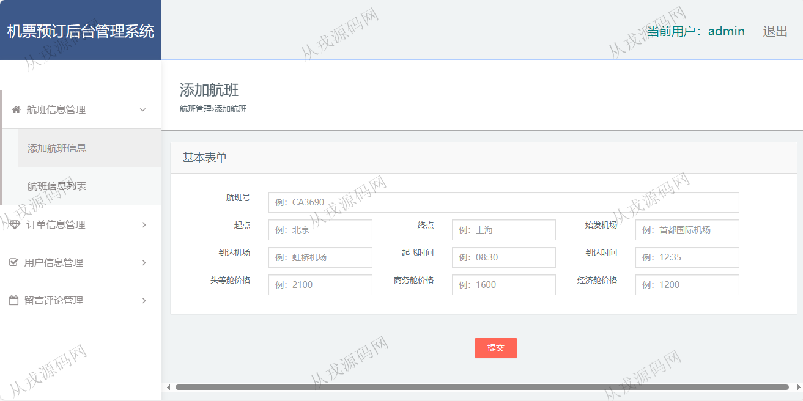
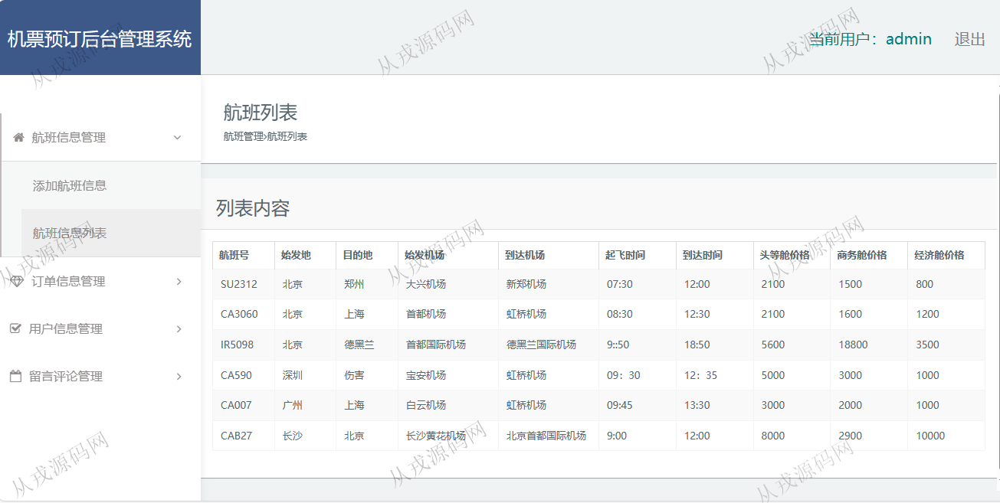
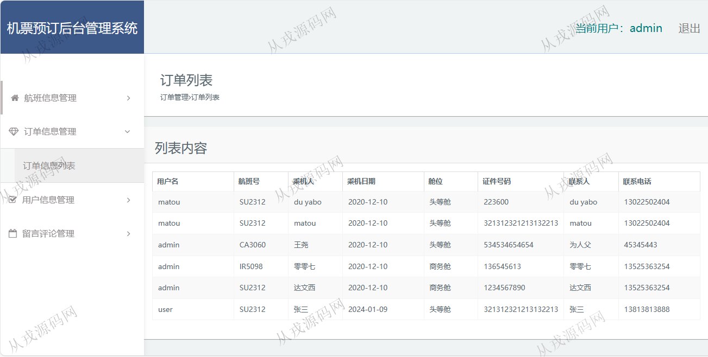

<h1 align="center">128.机票预订后台管理系统</h1>

 获取sql文件 QQ: 386869957 QQ群: 377586148 

 [更多源码项目: 从戎源码网](https://armycodes.com/) 

## 简介

> 本代码来源于网络,仅供学习参考使用!
>
> 提供1.远程部署/2.修改代码/3.设计文档指导/4.框架代码讲解等服务
>
> 用户端访问地址：http://localhost:8080/jsp_plane_ticket_book/default/index.jsp
>
> 用户：user 123456
> 
> 管理后台访问地址：http://localhost:8080/jsp_plane_ticket_book/admin/index.jsp
>
> 管理员：admin 123456
> 

## 项目介绍
基于jsp+servlet的机票预订后台管理系统：前端 jsp、jquery，后端 servlet、jdbc，角色分为管理员、用户；集成航班信息查询，在线订票，订单查询等功能于一体的系统。

## 功能介绍

### 管理员

- 航班信息管理：航班信息列表查询，航班添加
- 订单信息管理：用户在前台浏览航班信息，订票下单后，管理员可以在后台查询用户下单信息
- 用户信息管理：用户信息由客户自己在前台注册，管理员可以查看和删除用户
- 留言评论管理：用户在前台针对航班信息或订票服务进行评论，后台查看评论和删除

### 用户

- 基本功能：登录，注册，退出
- 网站首页：轮播图，航班搜索，航班列表信息展示
- 订票：航班详情，在线订票，填写乘机人和联系人信息，退改签说明，提交订单
- 用户中心：个人资料查询与修改，订单列表查询
- 留言：留言列表查看，发表留言评论

## 环境

- <b>IntelliJ IDEA 2021.3</b>

- <b>Mysql 5.7.26</b>

- <b>Tomcat 7.0.73</b>

- <b>JDK 1.8</b>

## 运行截图

